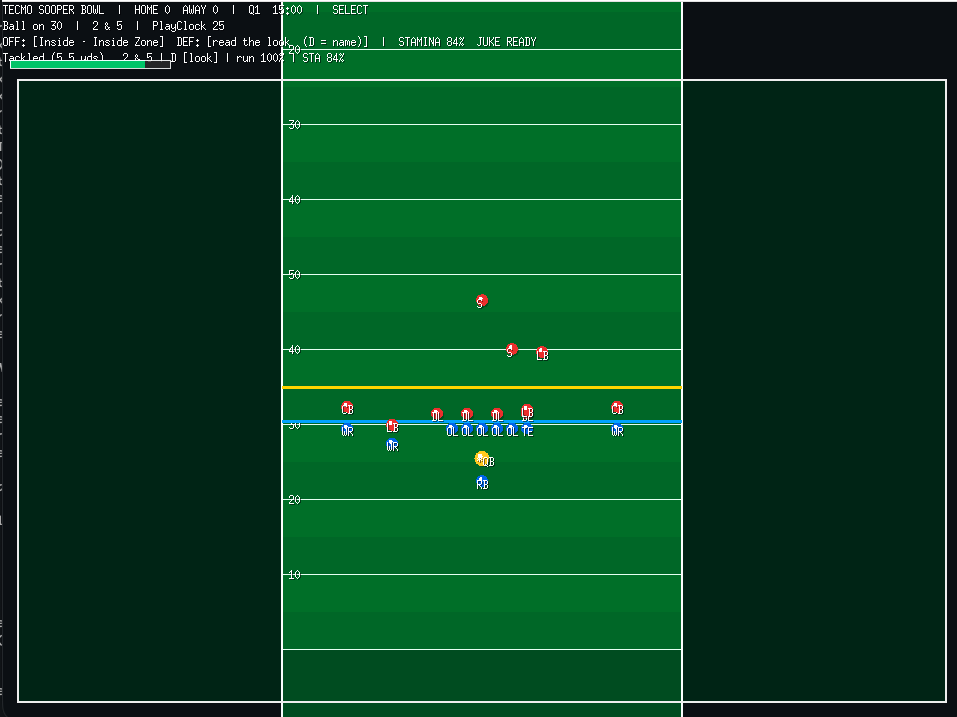

# Tecmo Sooper Bowl — Design Document

> Working title on purpose. Tecmo-inspired American football with a smarter defensive brain — not a byte-accurate NES rom.

**Status:** Phase 3 brain + readable looks (playable prototype)
**Repo:** [tecmo-sooper-bowl](https://github.com/randerson1184/tecmo-sooper-bowl)
**Last updated:** 2026-08-15

---

## 1. Elevator pitch

A **fast, readable, arcade** football game that *feels* like Tecmo Super Bowl: short playbooks, star power, big moments — plus **defenses that learn your tendencies** so the same cheese run does not work forever.

**Not** Madden. **Not** a pixel-perfect Tecmo clone. **Yes** Tecmo *soul* + modern CPU awareness.

---

## 2. Pillars (non-negotiable)

1. **Readable in two seconds** — formation, ball, sticks, down/distance are obvious.
2. **Arcade, not sim** — small playbooks, exaggerated athleticism, decisive outcomes.
3. **Stars matter** — ratings create identity (elite RB vs elite CB feels different).
4. **CPU has a plan** — tendencies → game plans → fewer free blown coverages.
5. **Always playable** — every milestone ends in “I can run a drive.”

## 3. Non-goals (for a long time)

- Pixel-perfect NES sprites / frame-accurate Tecmo mechanics
- Full modern NFL playbooks and playbooks from real film
- Online multiplayer (maybe much later)
- Machine-learning models inside the game
- Photoreal graphics

---

## 4. Language & stack

### Decision: **Go + [Ebitengine](https://ebitengine.org/)**

| Criterion | Why Go + Ebitengine wins here |
|-----------|-------------------------------|
| **Performance** | Plenty for 22 stick-figure athletes + 2D field; 60 FPS is easy |
| **Portability** | Cross-compile to **macOS / Windows / Linux** single binaries |
| **Share / playtest** | Native builds *and* **WebAssembly** browser builds (link to play) |
| **Vibe-coding fit** | Same language as `snake-cli`; small surface area; great tooling |
| **Distribution** | `go build` artifacts, GitHub Releases, optional itch.io / static host for WASM |

### Alternatives considered

| Stack | Pros | Cons | Verdict |
|-------|------|------|---------|
| **TypeScript + Canvas** | Zero-install playtest in browser | Heavier “game feel” plumbing; packaging later is messier | Great for a pure web jam; secondary if we need max frictionless testing first |
| **Rust + macroquad/bevy** | Max perf, great WASM story | Steeper for iteration speed while designing feel | Overkill for v1 |
| **Godot** | Fast content iteration, exporters | Engine-shaped repo; less “from scratch systems” learning | Fine if art-heavy later; not our start |
| **Python + pygame** | Easy prototypes | Packaging & “send to friend” friction | Skip for shipping |

**Portable playtest path**

1. Dev: `go run ./cmd/game` on your Mac
2. Friends (native): attach platform binaries on a Release
3. Friends (easiest): `GOOS=js GOARCH=wasm` build → static page (GitHub Pages)

---

## 5. Feel targets (Tecmo soul)

| Feel | Design choice |
|------|----------------|
| Play call | Pre-snap menu: few formations × few plays (not 500 concepts) |
| Control | User steers ball carrier / QB timing window; rest is assignment AI |
| Pace | Snappy downs; minimal sim simming between plays |
| Stamina | Heavy usage of one skill player degrades burst/success (phase 2) |
| Juice | Big play feedback (phase 2+): screen flash, text pop, simple SFX |

---

## 6. Adaptive defense (the differentiator)

**No neural nets.** Explicit, tunable systems.

### 6.1 Tendency tracker

Bucket recent offensive plays (e.g. last 12–20):

- Play type: run / pass
- Side: left / middle / right
- Depth: short / intermediate / deep (passes)
- Situation: down + distance class (e.g. short yardage, 3rd/4th & long, red zone)
- **Effectiveness** (separate from frequency): success / explosives, decayed over a 12-play window
- **Called pass vs actual throw vs QB keep**: `PassPct` is what they selected; `PassThreat` is only real throws; `KeepThreat` is QB runs. A scramble does not teach the staff “the slant is working.”
- Live `KeepThreat` vetoes lighting the box the same way `RunThreat` does, and a paid spy must be able to finish the tackle.
- A correct post vs two-high is a 12–16 yard shot, not 30 yards of YAC. Deep halves wrap after the catch. Blitz still sets a sweep edge.
- Inside zone vs Cover 2: the Mike fills the hole. Two-high is not a vacant A-gap.
- Cover 3 / Pass Rush cannot assign a bailed deep-third CB as the sweep alley; the playside flat/hook sets the edge.

### 6.2 Front / pressure (independent of coverage)

| Front | Intent |
|------|--------|
| `Base` | Balanced box |
| `RunFit` | Extra box defender, tighter run fits |
| `PassRush` | More pressure |
| `SoftZone` | Light box; second level stays back. Still sets an edge — a correct sweep is a gain, not a vacant alley. |
| `Blitz` | Send extra; risk a big play |

### 6.3 Coverage shells (independent of front)

A call is **Front + Shell**, e.g. `Run Fit / Cover 3`. Shells are arcade, tuned to the current book (inside / sweep / slant / hitch / post):

| Shell | Intent |
|------|--------|
| `Cover 3` | Concede controlled underneath; prevent explosive YAC |
| `Cover 2` | Corners squat the flats (contest hitch); slant/post is the give |
| `Man Free` | Tight window + pressure; YAC if you win |

Frequency can shade a front; **success can veto the give-up.** A pass diet lights the box only if the run is not already working (`RunThreat`). Same pattern as the QB-keep spy.

Hard assignment constraints (`coverage_test.go`):

- Cover 3: left / middle / right deep thirds have owners
- Cover 2: two deep halves + two flats
- Man Free: every WR has a man; one deep free safety
- Deep landmarks sit at least 10 yards past the LOS

Blown coverages become **rare failures of tradeoffs**, not “everyone chase the ball.”

### 6.4 Player-facing feedback

HUD hides the named call. The player reads four pictures — one-high corners off (Cover 3), one-high press (Man Free), two-high corners squat (Cover 2), two-high press later (Cover 2 man). **D** names the call; when they lie it prints `look → live`.

### 6.5 Disguise (staff quality)

Same pre-snap picture, different post-snap shell. Front is never faked.

| Live | Fake look |
|------|-----------|
| Cover 2 | 1-high (Cover 3) |
| Cover 3 | 2-high (Cover 2) |
| Man Free | 1-high off (Cover 3) |

`ai.Staff.Disguise` is 0..1. **Poor teams = 0 (never).** Elite = 1 (~30% of snaps). This roster is the **baseline (0.40, ~15%)**. Jobs are the live shell; positions start on the look and rotate after the snap. Team tiers later just hang a number on the roster.

### 6.6 Film notes (2026-08-15/16)

- **`runT` is success, not volume.** A run scores only if it gains ≥ 4 (or a TD). `run%` is how often you handed off. Stuffed IZ into Run Fit drives `runT` to 0.
- **PA leftover** is mesh (0.22s) + leftover. Cold leftover = 0. Warm (`runT≥1.5`) = 0.48 (bite ~0.70). Hot (`≥2.5`) = 0.58 (bite ~0.80). Run Fit +0.08. Live run vetoes pass-sell crush (floor 0.36). The sit is the cue — leftover lasts until he plants, not a 14-frame link.
- **PA Glance:** leftover sit behind the Mike. Plant by ~0.40s. Throw while `PA WINDOW` is up. Miss it and he sits in traffic; a late throw after a live run must not pay like leftover. Holding it is not a delayed Post.
- **Sweep vs Cover 3 / light box** is closed (contain at LOS+2.2, squeezes bounce). Correct stretch still gains; not a +55 walk-off.
- **Slant keep vs Cover 2:** hole player holds the A-gap. Freelance ~+6–8 median. Thrown slant vs press stays the give.
- **Hitch on throw:** flats/man play the receiver, not `BallPos` (that was the QB). Diet film 21/22 complete was the CB crashing the pocket on release.
- **Remember, don’t patch unless they loop:** IZ crease vs Man Free / base; Post / PA Post vs Cover 2 if you hold it; cold Glance vs Cover 2; sweep house vs Cover 3 / light.



---

## 7. Architecture

```
Tecmo_Sooper_Bowl/
├── DESIGN.md                 # this file
├── README.md
├── go.mod
├── cmd/
│   └── game/                 # entrypoint (window, loop)
│       └── main.go
├── internal/
│   ├── field/                # geometry, yards, hash marks, bounds
│   ├── game/                 # match state: down, distance, clock, score
│   ├── playbook/             # formations, routes, blocking assignments
│   ├── sim/                  # movement, collision, tackle, catch, throw
│   ├── ai/                   # pursuit, coverage, play calling, tendencies
│   ├── ratings/              # player attributes (phase 2)
│   └── render/               # draw field, players, UI (Ebitengine)
└── web/                      # wasm glue / index.html (when we ship browser)
```

**Rule:** `sim` and `ai` must be testable **without** a window (pure logic). Rendering is a thin view over state.

### Core loop (one play)

```
PreSnap → SelectPlay → Snap → ResolvePlay (ticks) → DeadBall → UpdateTendencies → NextDown / Score
```

---

## 8. Phased roadmap

### Phase 0 — Skeleton

- [x] DESIGN.md
- [x] Module + package layout
- [x] Window + field draw + placeholder units
- [x] Stub play state (down/distance/score)
- [x] Stub tendency + game-plan types

### Phase 1 — Vertical slice (current)

**Exit criteria:** one full **drive** is fun with ugly graphics.

- [x] 11v11 placeholders on a 100-yard field
- [x] 4 offensive **slots** (inside / outside / quick / shot) — hitch is Shift+3; post is 4
- [x] Defense calls affect pursuit / coverage (Base, RunFit, SoftZone, PassRush, Blitz)
- [x] Snap → handoff / pass → control RB or QB → tackle / OOB / sack / incomplete / TD
- [x] First downs, turnovers on downs, re-spot after score at own 25
- [ ] Juice / camera follow (optional)

### Phase 2 — Feel (current)

- [x] Camera follow + zoom on the ball
- [x] Larger player sprites with role labels
- [x] Stamina / fatigue on featured ball carriers (RB/QB/WR)
- [x] Juke / spin (Shift) with cooldown + evade window
- [ ] Basic ratings sheet (speed, power, hands, coverage)
- [ ] Better tackle angles / broken tackles from power
- [ ] Play-select UX closer to Tecmo cadence

### Phase 3 — Brain

- [x] Live tendency tracker wired into CPU play calling
- [x] Coverage shells (Cover 3 / Cover 2 / Man Free) as a separate concept from fronts
- [x] Coverage assignment invariants (`internal/sim/coverage_test.go`)
- [ ] Situational blitz logic
- [x] Readable pre-snap pictures; named call hidden (**D** reveals `Front / Shell`)
- [x] Pass-pro assignments + pocket budget (success/threat, not just RunPct)
- [x] Sweep contain on every front, including light boxes and blitz (Run Fit is stronger, not the only edge)
- [x] Cover 3 / light-box sweep: contain walks down to the LOS and squeezes if they bounce outside
- [x] Slant keep vs Cover 2: hole player holds the A-gap and finishes the tackle (not a first-down Cover 3 spy)
- [x] Post YAC: deep halves wrap so a Cover 2 shot is not a house
- [x] Pass-heavy looks do not light the box if `RunThreat` or `KeepThreat` is live
- [x] QB-keep / scramble: spy in the hole; keep flips coverage to run pursuit; tagged for game-plan
- [x] Four pre-snap pictures; named call hidden (debug toggle)
- [x] Shift+4 play-action post (callable anytime; run success changes bite, not availability)
- [x] PA mesh is a real state (buffer throw / abort fake / bite only after a committed mesh)
- [x] PA leftover window: cold recovers when the mesh ends; a live run (or Run Fit) keeps them down after; pass-sell cuts leftover, not the fake
- [x] Leftover lasts until the glance sit (~0.70s warm) so the HUD window is hittable; hot-late pays less than leftover
- [x] Live `RunThreat` vetoes leftover crush the same way it vetoes lighting the box (pass-sell only shaves; floor ~0.20s)
- [x] PA glance (Shift+4): sit beside/behind leftover Mike; wrap so cold is a 6–8 yard stop, leftover is the 11-yard shot
- [x] Glance stays a glance: miss the leftover and he sits in traffic (not a delayed Post)
- [x] Mesh abort consumes Shift before juke (no burst / invuln on abort)
- [x] Designed runs have a baseline role: IZ ~2.5–4 outside Run Fit; Sweep ~3–5 with occasional chunks
- [x] Repeated QB keeps get progressively less attractive (`KeepN` fills the hole; `KeepThreat` still buys the spy)
- [x] Occasional disguise (same picture, different post-snap); staff `Disguise` 0 = never, 1 = elite (~30%)

### Phase 4 — Content & juice

- [ ] Team/roster data files
- [ ] Season shell (schedule, standings)
- [ ] SFX / simple presentation
- [x] Local WASM playtest + anonymous film download
- [x] GitHub Pages public link; first-snap counter; explicit film upload (gameplay JSONL only, 90-day KV)
- [ ] Balance pass with recorded “cheese” scenarios as regression tests

---

## 9. MVP vertical slice (definition of done)

You can:

1. Launch the game
2. Pick from a tiny playbook
3. Run or pass once per play
4. Move the chains or score
5. Face a CPU that at least **calls different defenses** (even if dumb)
6. Quit cleanly

Graphics may be rectangles. Fun > fidelity.

---

## 10. Testing strategy

| Layer | How |
|-------|-----|
| Field math / down logic | `go test` pure functions |
| Tendency → plan selection | Table-driven tests with scripted play histories |
| Coverage invariants | “After assignment, deep third has owner” assertions |
| Feel | Human playtests; record cheese clips as future fixtures |

---

## 11. Open questions

- 11v11 from day one vs 7v7 until feel is right? **Lean 11v11 placeholders, simplified roles.**
- Camera: full field always vs sideline scroll? **MVP: fit full field in window.**
- Two-player hotseat? **After Phase 1.**
- Real NFL names/teams? **No — fictional or generic until legal comfort; “Sooper” is a feature.**

---

## 12. Success metrics (qualitative)

- A friend can score a TD without a tutorial longer than 30 seconds
- Running the same play 8 times in a row **gets harder**, not identical
- Deep shots are earned (mismatch, blitz punishment), not free
- You still say “one more drive” at 1 a.m.

---

## 13. License / credit (intent)

- Original code: project author’s (MIT likely, same as snake-cli)
- Tecmo / NFL are trademarks of their owners — this is a **fan-inspired original**, not affiliated

---

*Next: team tiers hang `Staff.Disguise` on the roster (poor = 0, elite = 1). Optional honesty: glance sit-means-sit if hold stays a house; IZ vs Man Free crease if it loops.*
