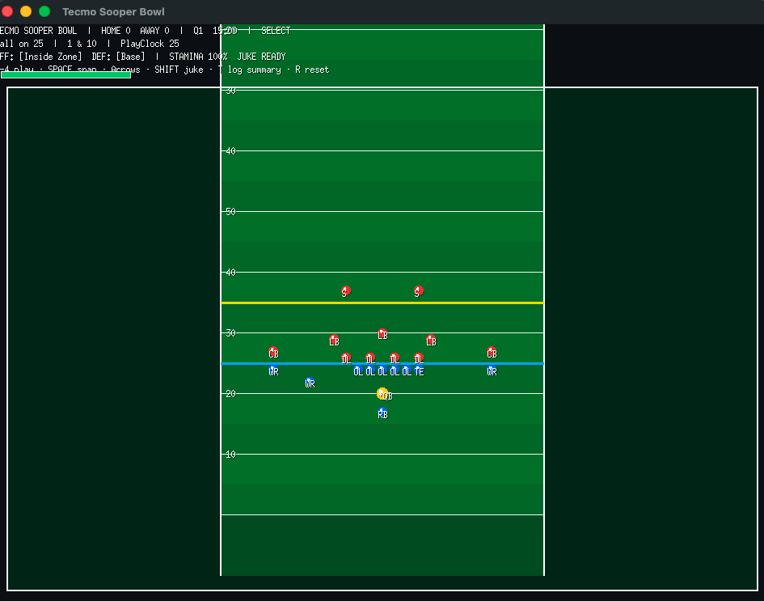

# Tecmo Sooper Bowl

**Status: in development** — playable prototype, balance and features still moving fast.

A **Tecmo-inspired** arcade football game written in Go: short playbooks, a live snap loop, stamina, jukes, and defenses that start to **catch your tendencies**.

> Not affiliated with Tecmo, Nintendo, or the NFL. “Sooper” is intentional.



## Quick start

```bash
git clone https://github.com/randerson1184/tecmo-sooper-bowl.git
cd tecmo-sooper-bowl
go run ./cmd/game
```

Requires **Go 1.21+**. On macOS, Xcode Command Line Tools are usually enough for Ebitengine.

## Controls

| Key | Action |
|-----|--------|
| **1–4** | Select play (pre-snap) |
| **Space** | Snap · on passes, **throw** to primary (green ring) |
| **↑ ↓ ← →** | Steer QB / ball carrier (**↑** = toward their end zone) |
| **Shift** / **E** | Juke (burst + short tackle evade) |
| **T** | Play-log summary (terminal) |
| **R** | Reset drive |
| **Esc** | Quit |

## What’s in already

- Full-field camera that zooms on the ball  
- 4-play book: Inside Zone, Toss Sweep, Sslant, Hitch  
- O-line push, pursuit, tackles, sacks, incompletes, TDs  
- Stamina + juke  
- Tendency-aware defense calls (e.g. spam runs → Run Fit)  
- JSONL play logging under `logs/` for balance tuning  

## Plays

1. **Inside Zone** — up the gut  
2. **Toss Sweep** — stretch right (defense will load the edge if you live here)  
3. **Slant** — quick timing throw to the green-ring primary  
4. **Hitch** — outside stop + YAC  

## Stack

| Piece | Choice |
|-------|--------|
| Language | Go |
| Engine | [Ebitengine](https://ebitengine.org/) |
| Why | Fast 2D, single binaries, later WASM playtests |

Design notes and phases: **[DESIGN.md](DESIGN.md)**

## Project layout

```
cmd/game/           window + game loop
internal/field/     yard geometry
internal/game/      score, down, distance
internal/playbook/  plays + defense calls
internal/sim/       snap loop, blocks, tackle, pass
internal/ai/        tendencies + ChooseDefense
internal/render/    camera + draw
internal/logplay/   session play logs
docs/               screenshots
```

## Dev

```bash
go test ./...
go build -o tecmo-sooper-bowl ./cmd/game
```

## Roadmap (rough)

- [x] Playable snap loop  
- [x] Camera, stamina, juke  
- [x] Run blocking + play balance pass  
- [x] Play logging  
- [ ] Clearer defensive “they’re loading the box” feedback  
- [ ] Ratings / broken tackles  
- [ ] Season shell  
- [ ] WASM browser build for one-click playtests  

## License

MIT — see [LICENSE](LICENSE).

## Credits

Fan-inspired original. Built for fun and for learning Go game systems.
